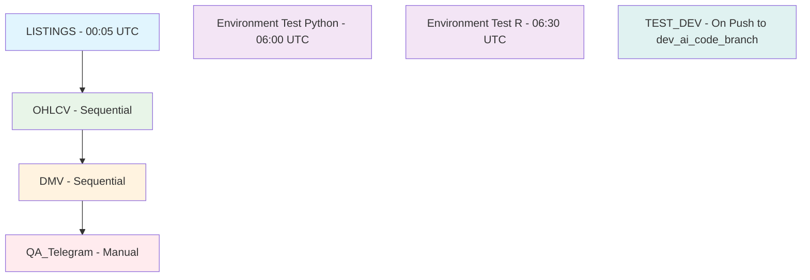

# CryptoPrism-DB CRON Schedule & Workflow Documentation

Comprehensive reference for all GitHub Actions workflows, their scheduling, dependencies, and script execution patterns.

---

## 🕒 Quick Schedule Reference

| Workflow | Trigger Time (UTC) | Trigger Time (IST) | Frequency | Type | Status |
|----------|-------------------|-------------------|-----------|------|--------|
| **LISTINGS** | 00:05 Daily | 05:35 Daily | Daily | Scheduled | ✅ Active |
| **OHLCV** | After LISTINGS | ~05:40-06:00 | Daily | Sequential | ✅ Active |
| **DMV** | After OHLCV | ~06:00-07:00 | Daily | Sequential | ✅ Active |
| **Environment Test (Python)** | 06:00 Daily | 11:30 Daily | Daily | Scheduled | ✅ Active |
| **Environment Test (R)** | 06:30 Daily | 12:00 Daily | Daily | Scheduled | ✅ Active |
| **QA_Telegram** | Manual Only | Manual Only | On-Demand | Manual | ⚠️ Manual |
| **TEST_DEV** | On Push | On Push | Event-Based | Development | 🔧 Dev Only |

---

## 🔄 Pipeline Flow Diagram



---

## 📋 Detailed Workflow Documentation

### 1. **LISTINGS** - Data Collection Trigger
- **File**: `.github/workflows/LISTINGS.yml`
- **Schedule**: `cron: '05 0 * * *'` (Daily at 00:05 UTC / 05:35 IST)
- **Primary Script**: `gcp_postgres_sandbox/data_ingestion/cmc_listings.py`
- **Purpose**: Fetch top 1000 cryptocurrency listings from CoinMarketCap API
- **Duration**: ~5-10 minutes
- **Triggers**: OHLCV workflow upon completion

### 2. **OHLCV** - Historical Data Collection
- **File**: `.github/workflows/OHLCV.yml`
- **Schedule**: `workflow_run: ["LISTINGS"]` (Sequential after LISTINGS)
- **Estimated Time**: ~05:40-06:00 IST (05:10-05:30 UTC)
- **Primary Script**: `gcp_postgres_sandbox/data_ingestion/gcp_108k_1kcoins.R`
- **Purpose**: Collect OHLCV (Open, High, Low, Close, Volume) historical data via R
- **Duration**: ~15-30 minutes
- **Triggers**: DMV workflow upon completion

### 3. **DMV** - Technical Analysis Pipeline
- **File**: `.github/workflows/DMV.yml`
- **Schedule**: `workflow_run: ["OHLCV"]` (Sequential after OHLCV)
- **Estimated Time**: ~06:00-07:00 IST (05:30-06:30 UTC)
- **Scripts Executed** (in order):
  1. `gcp_postgres_sandbox/data_ingestion/gcp_fear_greed_cmc.py` - Market sentiment
  2. `gcp_postgres_sandbox/technical_analysis/gcp_dmv_met.py` - Fundamental metrics
  3. `gcp_postgres_sandbox/technical_analysis/gcp_dmv_tvv.py` - Volume/trend analysis
  4. `gcp_postgres_sandbox/technical_analysis/gcp_dmv_pct.py` - Risk/volatility metrics
  5. `gcp_postgres_sandbox/technical_analysis/gcp_dmv_mom.py` - Momentum indicators
  6. `gcp_postgres_sandbox/technical_analysis/gcp_dmv_osc.py` - Technical oscillators
  7. `gcp_postgres_sandbox/technical_analysis/gcp_dmv_rat.py` - Financial ratios
  8. `gcp_postgres_sandbox/technical_analysis/gcp_dmv_core.py` - **Final aggregation**
- **Purpose**: Complete technical analysis with 100+ indicators
- **Duration**: ~45-60 minutes

### 4. **QA_Telegram** - Quality Assurance
- **File**: `.github/workflows/QA.yml`
- **Schedule**: `workflow_dispatch` (Manual execution only)
- **Primary Script**: `gcp_postgres_sandbox/quality_assurance/prod_qa_dbcp.py`
- **Purpose**: AI-powered quality assurance with Telegram alerts
- **Duration**: ~10-15 minutes
- **Note**: Currently runs only active QA script, others are commented out

### 5. **Environment Test (Python)**
- **File**: `.github/workflows/env_test_python.yml`
- **Schedule**: `cron: '0 6 * * *'` (Daily at 06:00 UTC / 11:30 IST)
- **Primary Script**: `gcp_postgres_sandbox/tests/functional_tests/env_test.py`
- **Purpose**: Validate Python environment and database connections
- **Duration**: ~3-5 minutes

### 6. **Environment Test (R)**
- **File**: `.github/workflows/env_test_r.yml`
- **Schedule**: `cron: '30 6 * * *'` (Daily at 06:30 UTC / 12:00 IST)
- **Primary Script**: `gcp_postgres_sandbox/tests/functional_tests/env_test.R`
- **Purpose**: Validate R environment and database connections
- **Duration**: ~3-5 minutes

### 7. **TEST_DEV** - Development Validation
- **File**: `.github/workflows/TEST_DEV.yml`
- **Schedule**: `push: dev_ai_code_branch` + `workflow_dispatch`
- **Primary Script**: `gcp_postgres_sandbox/data_ingestion/cmc_listings.py` (test execution)
- **Purpose**: Validate development branch changes
- **Duration**: ~5-10 minutes
- **Trigger**: Automatic on push to development branch

---

## ⏰ Time Zone Conversion Reference

### Common UTC to IST Conversions
| UTC Time | IST Time | Description |
|----------|----------|-------------|
| 00:00 | 05:30 | Midnight UTC |
| 00:05 | 05:35 | LISTINGS trigger |
| 06:00 | 11:30 | Python env test |
| 06:30 | 12:00 | R env test |
| 12:00 | 17:30 | Noon UTC |
| 18:00 | 23:30 | Evening UTC |

**Formula**: IST = UTC + 5:30 hours

---

## 🔧 Manual Workflow Execution

### Triggering Workflows Manually:
1. **Navigate to**: GitHub Repository → Actions tab
2. **Select Workflow**: Choose from the workflow list
3. **Run Workflow**: Click "Run workflow" button (if `workflow_dispatch` is enabled)

### Workflows with Manual Triggers:
- ✅ **LISTINGS** - Has `workflow_dispatch`
- ✅ **OHLCV** - Has `workflow_dispatch` 
- ✅ **DMV** - Has `workflow_dispatch`
- ✅ **QA_Telegram** - Manual only
- ✅ **TEST_DEV** - Has `workflow_dispatch`
- ❌ **Environment Tests** - Schedule only (no manual trigger)

---

## 📊 Workflow Dependencies & Data Flow

### Primary Pipeline (Critical Path):
```
LISTINGS (CoinMarketCap Data) 
    ↓
OHLCV (Historical Price Data)
    ↓  
DMV (Technical Analysis)
    ↓
QA_Telegram (Quality Assurance) [Manual]
```

### Independent Workflows:
- **Environment Tests** - Run independently for system validation
- **TEST_DEV** - Development branch validation, independent of main pipeline

### Database Impact:
1. **LISTINGS** → Updates `crypto_listings_latest_1000` table
2. **OHLCV** → Updates `1K_coins_ohlcv` table
3. **DMV** → Updates all technical analysis tables (`FE_*` prefix)
4. **QA** → Reads from all databases for validation

---

## 🚨 Critical Pipeline Timing

### Peak Processing Hours (IST):
- **05:35 - 07:30**: Primary data pipeline execution
- **11:30 - 12:30**: Environment validation tests

### Maintenance Windows:
- **Best Time for Maintenance**: 01:00-04:00 IST (19:30-22:30 UTC previous day)
- **Avoid Maintenance During**: 05:30-08:00 IST (pipeline execution hours)

---

## 📝 Script-to-Workflow Mapping

### Data Ingestion Scripts:
- `data_ingestion/cmc_listings.py` → **LISTINGS** workflow
- `data_ingestion/gcp_108k_1kcoins.R` → **OHLCV** workflow  
- `data_ingestion/gcp_fear_greed_cmc.py` → **DMV** workflow
- `data_ingestion/gcp_cc_info.py` → Not currently in automated workflows

### Technical Analysis Scripts (All in DMV workflow):
- `technical_analysis/gcp_dmv_met.py` → Fundamental metrics
- `technical_analysis/gcp_dmv_tvv.py` → Volume/value analysis
- `technical_analysis/gcp_dmv_pct.py` → Risk metrics
- `technical_analysis/gcp_dmv_mom.py` → Momentum indicators
- `technical_analysis/gcp_dmv_osc.py` → Oscillators
- `technical_analysis/gcp_dmv_rat.py` → Financial ratios
- `technical_analysis/gcp_dmv_core.py` → **Final aggregation** (must run last)

### Quality Assurance Scripts:
- `quality_assurance/prod_qa_dbcp.py` → **QA_Telegram** workflow (active)
- `quality_assurance/prod_qa_cp_ai.py` → **QA_Telegram** workflow (commented)
- `quality_assurance/prod_qa_cp_ai_backtest.py` → **QA_Telegram** workflow (commented)
- `quality_assurance/prod_qa_dbcp_backtest.py` → **QA_Telegram** workflow (commented)

### Testing Scripts:
- `tests/functional_tests/env_test.py` → **Environment Test (Python)** workflow
- `tests/functional_tests/env_test.R` → **Environment Test (R)** workflow

### Backtesting Scripts:
- `backtesting/gcp_dmv_mom_backtest.py` → Not currently in automated workflows
- `backtesting/test_backtest_mom_data.py` → Not currently in automated workflows

---

## 🔄 Maintenance Guidelines

### When to Update This Documentation:
1. **Workflow Schedule Changes** - Update CRON expressions and timing
2. **New Workflows Added** - Add to schedule table and pipeline flow
3. **Script Relocations** - Update script-to-workflow mappings
4. **Dependency Changes** - Modify pipeline flow diagram
5. **Manual Trigger Changes** - Update `workflow_dispatch` availability

### Maintenance Process:
1. **Identify Changes**: Review workflow YAML files for modifications
2. **Update Tables**: Modify schedule reference and script mapping tables
3. **Verify Timing**: Recalculate UTC to IST conversions if needed
4. **Test Documentation**: Ensure all links and references work
5. **Version Control**: Update CHANGELOG.md with documentation changes

### Related Documentation:
- **CHANGELOG.md** - Version history including workflow changes
- **CLAUDE.md** - Technical implementation details
- **README.md** - High-level system overview

---

## ⚠️ Important Notes

### Pipeline Reliability:
- **Sequential Dependencies**: OHLCV will not run if LISTINGS fails
- **Error Handling**: Each workflow stops on failure (`continue-on-error: false`)
- **Retry Mechanism**: Manual re-runs required for failures

### Development Considerations:
- **TEST_DEV** workflow ensures development branch stability
- **Environment tests** validate system health independently
- **Manual QA** allows on-demand quality assurance checks

### Security:
- All workflows use `testsecrets` environment for credential management
- No sensitive data is exposed in workflow logs
- Telegram notifications provide real-time monitoring

---

*Last Updated: 2025-09-05 | Maintained as part of CryptoPrism-DB documentation*