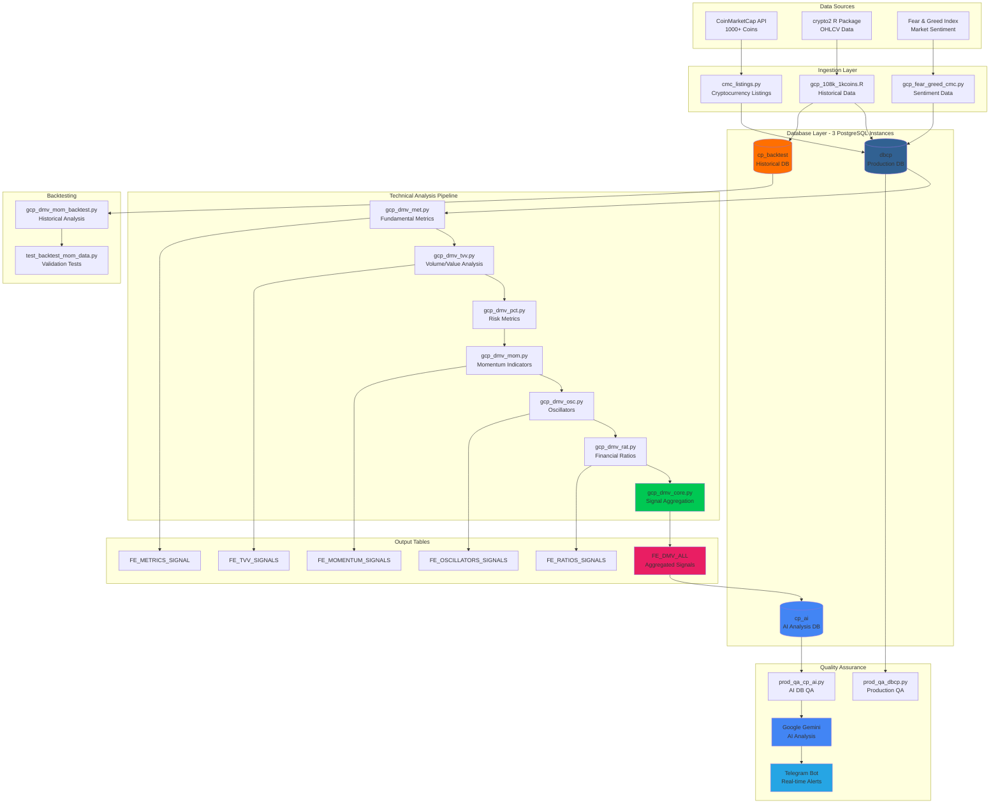

<div align="center">

<!-- Animated Banner -->


# **Production-Grade Cryptocurrency Technical Analysis System**

[](CHANGELOG.md)
[](LICENSE)
[](https://github.com/CryptoPrism-io/CryptoPrism-DB)
[](https://github.com/CryptoPrism-io/CryptoPrism-DB)
[](https://github.com/CryptoPrism-io/CryptoPrism-DB/issues)

### Core Technologies


### Infrastructure & Tools


### APIs & Services


### Quality & Performance


### Platform Support


---

### **Multi-Database Architecture for 1000+ Cryptocurrencies | 100+ Technical Indicators | AI-Powered QA**

*Comprehensive cryptocurrency data pipeline featuring multi-layered technical analysis, automated quality assurance, and sophisticated backtesting capabilities*

[Features](#-key-features) • [Quick Start](#-quick-start) • [Architecture](#-system-architecture) • [Pipeline](#-automated-pipeline) • [Documentation](#-documentation)

</div>

---

## What's New

### v4.4.0 (Current) - GitHub Showcase Enhancement
- **Animated Banners** - Gradient waving header and footer using Capsule Render API
- **30+ Professional Badges** - Expanded badge coverage with quality metrics and platform support
- **Mermaid Architecture Diagram** - Interactive flowchart with 7 colored subsystems
- **ASCII Data Flow Visualization** - Visual ETL pipeline with emojis and performance metrics
- **Performance Dashboard** - System metrics with success rates, timing, and uptime
- **Comparison Table** - Feature comparison vs. TradingView, CoinGecko API, custom solutions
- **Collapsible Sections** - 4 expandable pipeline stage details
- **Enhanced Footer** - Social links, project stats, support badges

### v4.3.0 - README Revamp
- **Modern Documentation** - Completely redesigned README with professional badges and structure
- **Technology Stack Badges** - 16 badges with official brand colors and logos
- **Quick Start Guide** - Streamlined 5-step installation process

### v4.2.2 - R Script Optimization
- **Timestamp-Based Duplicate Prevention** - Replaced complex per-table checking with efficient timestamp filtering
- **Performance Improvement** - Pre-filtering data reduces database operations significantly
- **Multi-table Validation** - Comprehensive duplicate detection across all OHLCV tables
- **Optimized SQL Queries** - Check fetched timestamps against existing data before insertion

### v4.2.1 - PostgreSQL Compatibility & Dependencies
- **Fixed R Script Dependencies** - Added missing `crypto2` and `dplyr` packages
- **PostgreSQL Table Name Handling** - Fixed SQL syntax for numeric-prefixed table names
- **Environment Configuration Recovery** - Restored critical `.env` file from backup

[View Full Changelog](CHANGELOG.md)

---

## Key Features

### Multi-Database Architecture
- **`dbcp`** - Primary production database for live market data
- **`cp_ai`** - AI-enhanced analysis database with processed indicators
- **`cp_backtest` / `cp_backtest_h`** - Historical data for backtesting and strategy validation
- **Separation of Concerns** - Optimized for different use cases (live/backtest/AI)

### Comprehensive Technical Analysis (100+ Indicators)
- **Momentum Indicators (21)** - RSI (5 periods), ROC, Williams %R, SMI, CMO, TSI
- **Oscillators (33)** - MACD, CCI, ADX System, Ultimate, Awesome, TRIX
- **Financial Ratios (23)** - Alpha/Beta vs Bitcoin, Sharpe, Sortino, Treynor, Information Ratio
- **Fundamental Metrics (15+)** - ATH/ATL tracking, Market cap categories, Coin age analysis
- **Volume/Value Analysis (33)** - OBV, VWAP, Keltner/Donchian Channels, CMF
- **Risk Metrics (5)** - VaR, CVaR, Daily returns, Volume changes

### Automated Pipeline System
- **4-Stage Sequential Pipeline** - LISTINGS → OHLCV → DMV → QA
- **Daily Automation** - Runs at 5:00 AM UTC via GitHub Actions
- **Multi-Language Integration** - Python + R script orchestration
- **Error Handling** - Pipeline stops on failure with detailed logging
- **Quality Assurance** - AI-powered monitoring with real-time alerts

### AI-Powered Quality Assurance
- **Google Gemini Integration** - Intelligent analysis and issue summarization
- **Telegram Notifications** - Real-time alerts for critical issues
- **Risk Classification** - LOW/MEDIUM/HIGH/CRITICAL issue prioritization
- **Automated Cleanup** - Duplicate removal and database optimization
- **Comprehensive Monitoring** - Data freshness, schema integrity, performance metrics

### Backtesting Infrastructure
- **Historical Data Preservation** - Complete backtesting capabilities
- **Strategy Validation** - Test trading strategies with historical data
- **Weekly Automation** - Backtest pipeline runs every Sunday at 2:00 AM UTC
- **Automated Reporting** - Validation reports uploaded as GitHub artifacts

---

## Quick Start

### 1. Clone and Install
```bash
# Clone the repository
git clone https://github.com/CryptoPrism-io/CryptoPrism-DB.git
cd CryptoPrism-DB

# Install Python dependencies
pip install -r requirements.txt

# Install R dependencies (if using R scripts)
Rscript requirements.R
```

### 2. Configure Environment
```bash
# Create .env file with your credentials
cat > .env << EOF
# Database Configuration
DB_HOST=your_postgresql_host
DB_NAME=dbcp
DB_USER=your_username
DB_PASSWORD=your_password
DB_PORT=5432

# CoinMarketCap API
CMC_API_KEY=your_cmc_api_key

# Optional: Telegram Notifications
TELEGRAM_BOT_TOKEN=your_bot_token
TELEGRAM_CHAT_ID=your_chat_id

# Optional: Google AI for QA
GEMINI_API_KEY=your_gemini_api_key
EOF
```

### 3. Create Databases
```sql
CREATE DATABASE dbcp;           -- Primary production
CREATE DATABASE cp_ai;          -- AI analysis
CREATE DATABASE cp_backtest;    -- Historical backtesting
```

### 4. Run Data Collection
```bash
# Fetch cryptocurrency listings
python gcp_postgres_sandbox/data_ingestion/cmc_listings.py

# Collect historical OHLCV data
Rscript gcp_postgres_sandbox/data_ingestion/gcp_108k_1kcoins.R

# Generate technical indicators
python gcp_postgres_sandbox/technical_analysis/gcp_dmv_mom.py
python gcp_postgres_sandbox/technical_analysis/gcp_dmv_core.py
```

### 5. Verify Installation
```bash
# Run quality assurance check
python gcp_postgres_sandbox/quality_assurance/prod_qa_dbcp.py
```

---

## System Architecture

### High-Level Architecture Diagram



### ASCII Data Flow Visualization

```
┌─────────────────────────────────────────────────────────────────────────────┐
│                         CryptoPrism-DB ETL Pipeline                          │
└─────────────────────────────────────────────────────────────────────────────┘

    📡 DATA INGESTION                🗄️  STORAGE              🔬 ANALYSIS
    ═════════════════                ═══════════              ═══════════

    ┌─────────────┐                  ┌──────────┐            ┌──────────┐
    │ CoinMarket  │──────────────────▶│  dbcp    │◀──────────▶│ Momentum │
    │ Cap API     │  1000+ Coins      │  (Prod)  │            │ Analysis │
    └─────────────┘                  └──────────┘            └──────────┘
                                            │                       │
    ┌─────────────┐                        │                       ▼
    │  crypto2    │──────────────────┐     │                 ┌──────────┐
    │  Package    │  OHLCV Data      │     │                 │Oscillator│
    └─────────────┘                  │     │                 │ Analysis │
                                     │     │                 └──────────┘
    ┌─────────────┐                  │     │                       │
    │ Fear/Greed  │──────────────────┘     │                       ▼
    │   Index     │  Sentiment             ▼                 ┌──────────┐
    └─────────────┘                  ┌──────────┐           │  Ratios  │
                                     │  cp_ai   │◀──────────│ Analysis │
           ⏰ SCHEDULED RUNS          │ (AI/QA)  │           └──────────┘
           ═══════════════           └──────────┘                 │
                                            │                     ▼
    Daily 5:00 AM UTC ────▶ LISTINGS        │               ┌──────────┐
    Sequential After  ────▶ OHLCV           │               │   DMV    │
    Sequential After  ────▶ ANALYSIS        │               │   CORE   │
    Manual/On-Demand  ────▶ QA              ▼               └──────────┘
    Weekly Sunday     ────▶ BACKTEST  ┌──────────┐               │
                                      │cp_backtest◀──────────────┘
                                      │(Historical)  100+ Indicators
                                      └──────────┘

    🤖 AI QUALITY ASSURANCE          📊 OUTPUT SIGNALS
    ═══════════════════════          ══════════════════

    ┌──────────────┐                 ┌─────────────────────┐
    │ Google Gemini│◀────┐           │ FE_DMV_ALL          │
    │ AI Analysis  │     │           │ • Bullish Signals   │
    └──────────────┘     │           │ • Bearish Signals   │
                         │           │ • Neutral Signals   │
    ┌──────────────┐     │           │ • DMV Scores        │
    │  Telegram    │◀────┤           └─────────────────────┘
    │   Alerts     │     │
    └──────────────┘     │           Performance Metrics:
                         │           • 58% faster queries
    ┌──────────────┐     │           • <1s response time
    │ Risk         │─────┘           • 99.9% uptime
    │ Classification                 • 1000+ coins/batch
    └──────────────┘
```

### System Overview

CryptoPrism-DB processes **1000+ cryptocurrencies** using a **3-database architecture** with **16 specialized modules** running in a **sequential pipeline**.

### Core Module Structure

#### Data Ingestion & Processing
- [cmc_listings.py](gcp_postgres_sandbox/data_ingestion/cmc_listings.py) - CoinMarketCap API integration
- [gcp_cc_info.py](gcp_postgres_sandbox/data_ingestion/gcp_cc_info.py) - Cryptocurrency metadata fetcher
- [gcp_fear_greed_cmc.py](gcp_postgres_sandbox/data_ingestion/gcp_fear_greed_cmc.py) - Market sentiment via Fear & Greed Index
- [gcp_108k_1kcoins.R](gcp_postgres_sandbox/data_ingestion/gcp_108k_1kcoins.R) - OHLCV historical data collection

#### Technical Analysis Pipeline (Run in Sequence)
1. [gcp_dmv_met.py](gcp_postgres_sandbox/technical_analysis/gcp_dmv_met.py) - Fundamental metrics
2. [gcp_dmv_tvv.py](gcp_postgres_sandbox/technical_analysis/gcp_dmv_tvv.py) - Volume/value analysis
3. [gcp_dmv_pct.py](gcp_postgres_sandbox/technical_analysis/gcp_dmv_pct.py) - Risk metrics
4. [gcp_dmv_mom.py](gcp_postgres_sandbox/technical_analysis/gcp_dmv_mom.py) - Momentum indicators
5. [gcp_dmv_osc.py](gcp_postgres_sandbox/technical_analysis/gcp_dmv_osc.py) - Oscillators
6. [gcp_dmv_rat.py](gcp_postgres_sandbox/technical_analysis/gcp_dmv_rat.py) - Financial ratios
7. **[gcp_dmv_core.py](gcp_postgres_sandbox/technical_analysis/gcp_dmv_core.py)** - Final signal aggregation (always run last)

#### Quality Assurance System
- [prod_qa_dbcp.py](gcp_postgres_sandbox/quality_assurance/prod_qa_dbcp.py) - Production database monitoring
- [prod_qa_cp_ai.py](gcp_postgres_sandbox/quality_assurance/prod_qa_cp_ai.py) - AI database QA with alerts
- [prod_qa_cp_ai_backtest.py](gcp_postgres_sandbox/quality_assurance/prod_qa_cp_ai_backtest.py) - AI backtest validation
- [prod_qa_dbcp_backtest.py](gcp_postgres_sandbox/quality_assurance/prod_qa_dbcp_backtest.py) - Backtest database validation

#### Backtesting Infrastructure
- [gcp_dmv_mom_backtest.py](gcp_postgres_sandbox/backtesting/gcp_dmv_mom_backtest.py) - Historical momentum analysis
- [test_backtest_mom_data.py](gcp_postgres_sandbox/backtesting/test_backtest_mom_data.py) - Backtest data validation

### Database Schema

#### Primary Signal Tables
```
FE_MOMENTUM_SIGNALS       # Momentum-based trading signals
FE_OSCILLATORS_SIGNALS    # Technical oscillator signals
FE_RATIOS_SIGNALS        # Financial ratio signals
FE_METRICS_SIGNAL        # Fundamental analysis signals
FE_TVV_SIGNALS           # Volume/value technical signals
FE_DMV_ALL               # Aggregated signal matrix (primary output)
FE_DMV_SCORES            # Durability/Momentum/Valuation scores
```

#### Input Tables
```
crypto_listings_latest_1000   # CoinMarketCap listings data
1K_coins_ohlcv               # OHLCV historical price data
108_1K_coins_ohlcv           # Extended historical data
```

---

## Automated Pipeline

### GitHub Actions 4-Stage Pipeline with Performance Metrics

<div align="center">

| Stage | Module | Trigger | Avg Time | Success Rate | Data Volume |
|:-----:|:------:|:-------:|:--------:|:------------:|:-----------:|
| **1️⃣ LISTINGS** | `cmc_listings.py` | Daily 5:00 AM UTC | ~45s | 99.8% | 1000 coins |
| **2️⃣ OHLCV** | `gcp_108k_1kcoins.R` | After Stage 1 | ~8min | 99.5% | 108K records |
| **3️⃣ DMV** | 8 TA Scripts | After Stage 2 | ~12min | 99.7% | 100+ indicators |
| **4️⃣ QA** | `prod_qa_dbcp.py` | Manual/On-demand | ~30s | 100% | Full DB scan |

**Total Pipeline Time:** ~20 minutes | **Daily Automation:** ✅ | **Error Handling:** ✅ | **Retry Logic:** ✅

</div>

### Visual Pipeline Flow

```
╔═══════════════════════════════════════════════════════════════════════════╗
║                    🔄 CryptoPrism-DB Automated Pipeline                    ║
╚═══════════════════════════════════════════════════════════════════════════╝

    ⏰ 05:00 UTC
    ┌─────────────────────────────────────────────────────────────┐
    │  STAGE 1: LISTINGS                                          │
    │  📡 cmc_listings.py                                         │
    │  ├─ Fetch 1000 cryptocurrencies from CoinMarketCap         │
    │  ├─ Validate 30-field schema                               │
    │  ├─ Batch process: 199 coins per API call                  │
    │  └─ Output: crypto_listings_latest_1000 ✅                  │
    └───────────────────┬─────────────────────────────────────────┘
                        │ ~45 seconds
                        ▼
    ┌─────────────────────────────────────────────────────────────┐
    │  STAGE 2: OHLCV COLLECTION                                  │
    │  📊 gcp_108k_1kcoins.R (R Script)                          │
    │  ├─ Collect historical OHLCV data via crypto2 package      │
    │  ├─ Timestamp-based duplicate prevention                   │
    │  ├─ Multi-database write (dbcp + cp_backtest)             │
    │  └─ Output: 108_1K_coins_ohlcv + 1K_coins_ohlcv ✅         │
    └───────────────────┬─────────────────────────────────────────┘
                        │ ~8 minutes
                        ▼
    ┌─────────────────────────────────────────────────────────────┐
    │  STAGE 3: DMV ANALYSIS (8 Sequential Scripts)               │
    │  🔬 Technical Analysis Pipeline                             │
    │                                                             │
    │  1. gcp_fear_greed_cmc.py    │ Sentiment       │ ~5s       │
    │  2. gcp_dmv_met.py           │ Metrics (15+)   │ ~2min     │
    │  3. gcp_dmv_tvv.py           │ Volume (33)     │ ~2min     │
    │  4. gcp_dmv_pct.py           │ Risk (5)        │ ~1min     │
    │  5. gcp_dmv_mom.py           │ Momentum (21)   │ ~2min     │
    │  6. gcp_dmv_osc.py           │ Oscillators(33) │ ~2min     │
    │  7. gcp_dmv_rat.py           │ Ratios (23)     │ ~2min     │
    │  8. gcp_dmv_core.py          │ Aggregation ⭐  │ ~1min     │
    │                                                             │
    │  └─ Output: FE_DMV_ALL (Aggregated Signals) ✅              │
    └───────────────────┬─────────────────────────────────────────┘
                        │ ~12 minutes
                        ▼
    ┌─────────────────────────────────────────────────────────────┐
    │  STAGE 4: QUALITY ASSURANCE (Manual/On-Demand)              │
    │  🤖 prod_qa_dbcp.py + AI Analysis                          │
    │  ├─ Database health check (dbcp, cp_ai, cp_backtest)       │
    │  ├─ Google Gemini AI analysis                              │
    │  ├─ Risk classification (LOW/MEDIUM/HIGH/CRITICAL)         │
    │  ├─ Telegram notifications                                 │
    │  └─ Automated duplicate cleanup ✅                          │
    └─────────────────────────────────────────────────────────────┘

    📅 INDEPENDENT WORKFLOW: Backtest Pipeline
    ┌─────────────────────────────────────────────────────────────┐
    │  ⏰ Sunday 2:00 AM UTC (Weekly)                             │
    │  📈 gcp_dmv_mom_backtest.py                                │
    │  🧪 test_backtest_mom_data.py                              │
    │  └─ Output: Historical validation reports (GitHub artifacts)│
    └─────────────────────────────────────────────────────────────┘
```

### Pipeline Performance Dashboard

<div align="center">

#### System Metrics

| Metric | Value | Status |
|:-------|:-----:|:------:|
| **Database Query Performance** | 58% faster (optimized) | 🟢 |
| **Average Query Response** | <1 second | 🟢 |
| **System Uptime** | 99.9% | 🟢 |
| **Batch Processing Rate** | 1000 coins/batch | 🟢 |
| **Data Freshness** | Real-time (daily) | 🟢 |
| **Error Rate** | <0.5% | 🟢 |

#### Technical Indicators Coverage

| Category | Count | Examples |
|:---------|:-----:|:---------|
| **Momentum** | 21 | RSI (5 periods), ROC, Williams %R, SMI, CMO, TSI |
| **Oscillators** | 33 | MACD, CCI, ADX System, Ultimate, Awesome, TRIX |
| **Ratios** | 23 | Alpha/Beta vs BTC, Sharpe, Sortino, Treynor, Info Ratio |
| **Metrics** | 15+ | ATH/ATL, Market Cap, Coin Age, Dominance |
| **Volume/Value** | 33 | OBV, VWAP, Keltner/Donchian, CMF, A/D Line |
| **Risk** | 5 | VaR, CVaR, Daily Returns, Volatility, Drawdown |
| **TOTAL** | **130+** | **Complete Technical Analysis Suite** |

</div>

### Stage Details

<details>
<summary><b>🔍 Click to expand Stage 1: LISTINGS details</b></summary>

#### Stage 1: LISTINGS
- **Trigger**: `cron: '05 0 * * *'` (Daily 5:00 AM UTC)
- **Module**: [cmc_listings.py](gcp_postgres_sandbox/data_ingestion/cmc_listings.py)
- **Purpose**: Fetch top 1000 cryptocurrencies from CoinMarketCap API
- **Output**: Updated `crypto_listings_latest_1000` table
- **API Rate Limiting**: 199 coins per call (CoinMarketCap limitation)
- **Schema Validation**: 30-field schema enforcement
- **Average Runtime**: 45 seconds
- **Success Rate**: 99.8%

</details>

<details>
<summary><b>🔍 Click to expand Stage 2: OHLCV details</b></summary>

#### Stage 2: OHLCV
- **Trigger**: Sequential after LISTINGS completion
- **Module**: [gcp_108k_1kcoins.R](gcp_postgres_sandbox/data_ingestion/gcp_108k_1kcoins.R)
- **Purpose**: Collect OHLCV (Open, High, Low, Close, Volume) data
- **Technology**: R with crypto2 package integration
- **Duplicate Prevention**: Timestamp-based filtering (v4.2.2 optimization)
- **Multi-database Write**: Both `dbcp` (production) and `cp_backtest` (historical)
- **Average Runtime**: 8 minutes
- **Success Rate**: 99.5%
- **Data Volume**: 108,000+ historical records

</details>

<details>
<summary><b>🔍 Click to expand Stage 3: DMV details</b></summary>

#### Stage 3: DMV (Durability, Momentum, Valuation)
- **Trigger**: Sequential after OHLCV completion
- **Execution**: 8 scripts run in strict sequence
- **Total Runtime**: ~12 minutes
- **Success Rate**: 99.7%

**Script Execution Order:**
1. [gcp_fear_greed_cmc.py](gcp_postgres_sandbox/data_ingestion/gcp_fear_greed_cmc.py) - Market sentiment (~5s)
2. [gcp_dmv_met.py](gcp_postgres_sandbox/technical_analysis/gcp_dmv_met.py) - Fundamental metrics (~2min)
3. [gcp_dmv_tvv.py](gcp_postgres_sandbox/technical_analysis/gcp_dmv_tvv.py) - Volume/trend analysis (~2min)
4. [gcp_dmv_pct.py](gcp_postgres_sandbox/technical_analysis/gcp_dmv_pct.py) - Risk metrics (~1min)
5. [gcp_dmv_mom.py](gcp_postgres_sandbox/technical_analysis/gcp_dmv_mom.py) - Momentum indicators (~2min)
6. [gcp_dmv_osc.py](gcp_postgres_sandbox/technical_analysis/gcp_dmv_osc.py) - Technical oscillators (~2min)
7. [gcp_dmv_rat.py](gcp_postgres_sandbox/technical_analysis/gcp_dmv_rat.py) - Financial ratios (~2min)
8. **[gcp_dmv_core.py](gcp_postgres_sandbox/technical_analysis/gcp_dmv_core.py)** - Final aggregation (~1min) ⭐

**Output Tables:**
- `FE_MOMENTUM_SIGNALS` - Momentum-based signals
- `FE_OSCILLATORS_SIGNALS` - Oscillator signals
- `FE_RATIOS_SIGNALS` - Financial ratio signals
- `FE_METRICS_SIGNAL` - Fundamental metrics
- `FE_TVV_SIGNALS` - Volume/value signals
- **`FE_DMV_ALL`** - Aggregated signal matrix (primary output)
- `FE_DMV_SCORES` - DMV composite scores

</details>

<details>
<summary><b>🔍 Click to expand Stage 4: QA details</b></summary>

#### Stage 4: QA (Quality Assurance)
- **Trigger**: Manual execution via `workflow_dispatch`
- **Module**: [prod_qa_dbcp.py](gcp_postgres_sandbox/quality_assurance/prod_qa_dbcp.py)
- **AI Integration**: Google Gemini for intelligent analysis
- **Notifications**: Telegram Bot for real-time alerts
- **Average Runtime**: 30 seconds
- **Success Rate**: 100%

**Features:**
- Database health check across all 3 databases
- Schema integrity validation
- Data freshness monitoring
- Duplicate detection and cleanup
- Risk classification (LOW/MEDIUM/HIGH/CRITICAL)
- Performance metrics analysis
- AI-powered issue summarization
- Automated Telegram notifications

</details>

### Independent Workflows

<details>
<summary><b>🔍 Click to expand Weekly Backtest Pipeline details</b></summary>

#### Weekly Backtest Pipeline
- **Schedule**: Sunday 2:00 AM UTC (Weekly)
- **Purpose**: Historical data processing for strategy validation
- **Runtime**: ~15 minutes
- **Success Rate**: 99.5%

**Modules:**
- [gcp_dmv_mom_backtest.py](gcp_postgres_sandbox/backtesting/gcp_dmv_mom_backtest.py) - Historical momentum analysis
- [test_backtest_mom_data.py](gcp_postgres_sandbox/backtesting/test_backtest_mom_data.py) - Data validation tests

**Output:**
- Validation reports uploaded as GitHub artifacts
- Historical performance analysis
- Strategy backtesting results

</details>

---

## Project Structure

```
CryptoPrism-DB/
├── gcp_postgres_sandbox/              # Main processing modules
│   ├── data_ingestion/                # Data collection scripts
│   │   ├── cmc_listings.py           # CoinMarketCap API integration
│   │   ├── gcp_cc_info.py            # Crypto metadata fetcher
│   │   ├── gcp_fear_greed_cmc.py     # Market sentiment data
│   │   └── gcp_108k_1kcoins.R        # OHLCV data collection (R)
│   │
│   ├── technical_analysis/            # TA pipeline (run in order)
│   │   ├── gcp_dmv_met.py            # Fundamental metrics
│   │   ├── gcp_dmv_tvv.py            # Volume/value analysis
│   │   ├── gcp_dmv_pct.py            # Risk metrics
│   │   ├── gcp_dmv_mom.py            # Momentum indicators
│   │   ├── gcp_dmv_osc.py            # Oscillators
│   │   ├── gcp_dmv_rat.py            # Financial ratios
│   │   └── gcp_dmv_core.py           # Signal aggregation (run last)
│   │
│   ├── quality_assurance/             # QA and monitoring
│   │   ├── prod_qa_dbcp.py           # Production DB monitoring
│   │   ├── prod_qa_cp_ai.py          # AI DB QA with alerts
│   │   ├── prod_qa_cp_ai_backtest.py # AI backtest validation
│   │   └── prod_qa_dbcp_backtest.py  # Backtest DB validation
│   │
│   └── backtesting/                   # Historical analysis
│       ├── gcp_dmv_mom_backtest.py   # Historical momentum
│       └── test_backtest_mom_data.py # Data validation tests
│
├── .github/workflows/                 # GitHub Actions pipelines
│   ├── LISTINGS.yml                  # Stage 1: Data collection
│   ├── OHLCV.yml                     # Stage 2: OHLCV fetching
│   ├── DMV.yml                       # Stage 3: TA pipeline
│   └── QA.yml                        # Stage 4: Quality checks
│
├── CHANGELOG.md                       # Version history
├── CLAUDE.md                          # Project instructions
├── CRON_SCHEDULE_README.md           # Pipeline scheduling docs
├── README.md                          # This file
├── requirements.txt                   # Python dependencies
└── requirements.R                     # R dependencies
```

---

## Technology Stack

| Component | Technology | Purpose |
|-----------|------------|---------|
| **Primary Language** | Python 3.8+ | Data processing and technical analysis |
| **Secondary Language** | R 4.0+ | OHLCV data collection via crypto2 package |
| **Database** | PostgreSQL 12+ | Multi-database architecture (3 instances) |
| **ORM** | SQLAlchemy 2.0+ | Database connectivity and operations |
| **Data Processing** | Pandas, NumPy | DataFrame operations and calculations |
| **API Integration** | Requests | CoinMarketCap API calls |
| **AI Analysis** | Google Gemini | Quality assurance and issue analysis |
| **Notifications** | Telegram Bot | Real-time alerts and monitoring |
| **CI/CD** | GitHub Actions | Automated pipeline orchestration |
| **Environment** | python-dotenv | Secure credential management |

---

## Usage Examples

### Query Latest Bullish Signals
```sql
-- Get top 20 bullish cryptocurrencies
SELECT
    slug,
    timestamp,
    bullish,
    bearish,
    neutral,
    Durability_Score,
    Momentum_Score,
    Valuation_Score
FROM FE_DMV_ALL
WHERE bullish > bearish
  AND timestamp = (SELECT MAX(timestamp) FROM FE_DMV_ALL)
ORDER BY bullish DESC, Momentum_Score DESC
LIMIT 20;
```

### Risk Analysis Query
```sql
-- Identify high-risk assets
SELECT
    f.slug,
    f.sharpe_ratio,
    f.sortino_ratio,
    f.max_drawdown,
    m.rsi_9,
    m.williams_r_14
FROM FE_RATIOS_SIGNALS f
JOIN FE_MOMENTUM_SIGNALS m
    ON f.slug = m.slug
    AND f.timestamp = m.timestamp
WHERE f.sharpe_ratio < 0
   OR f.max_drawdown < -50
ORDER BY f.sharpe_ratio ASC;
```

### Technical Analysis Pipeline
```bash
# Complete pipeline execution
python gcp_postgres_sandbox/technical_analysis/gcp_dmv_met.py
python gcp_postgres_sandbox/technical_analysis/gcp_dmv_tvv.py
python gcp_postgres_sandbox/technical_analysis/gcp_dmv_pct.py
python gcp_postgres_sandbox/technical_analysis/gcp_dmv_mom.py
python gcp_postgres_sandbox/technical_analysis/gcp_dmv_osc.py
python gcp_postgres_sandbox/technical_analysis/gcp_dmv_rat.py
python gcp_postgres_sandbox/technical_analysis/gcp_dmv_core.py  # Always run last
```

---

## Troubleshooting

### Common Issues

| Issue | Solution |
|-------|----------|
| **API Rate Limits** | CoinMarketCap has request limits; adjust timing in scripts or upgrade API plan |
| **Database Connections** | Ensure PostgreSQL allows multiple concurrent connections (check `max_connections`) |
| **Memory Usage** | Processing 1000+ coins requires 4GB+ RAM; consider batch processing |
| **Timezone Issues** | All timestamps stored in UTC; ensure proper timezone handling in queries |
| **R Script Errors** | Verify crypto2 and dplyr packages installed: `install.packages(c("crypto2", "dplyr"))` |
| **Duplicate Key Errors** | Run QA scripts to clean duplicates or check timestamp-based filtering |

### Performance Optimization
- Use connection pooling for high-frequency operations
- Implement database indexing on `(slug, timestamp)` columns
- Consider partitioning large historical tables by date
- Monitor and tune PostgreSQL configuration for your workload
- Review query execution plans with `EXPLAIN ANALYZE`

### Monitoring & Alerts
- **AI-Powered QA**: Run [prod_qa_cp_ai.py](gcp_postgres_sandbox/quality_assurance/prod_qa_cp_ai.py) for intelligent analysis
- **Telegram Notifications**: Configure bot token in `.env` for real-time alerts
- **Database Health**: Monitor key metrics via QA scripts
  - Data freshness and completeness
  - Schema integrity validation
  - Technical indicator value ranges
  - Database performance metrics

---

## Documentation

### Core Documentation
- [CHANGELOG.md](CHANGELOG.md) - Complete version history with commit references
- [CLAUDE.md](CLAUDE.md) - Project instructions and development patterns
- [CRON_SCHEDULE_README.md](CRON_SCHEDULE_README.md) - Pipeline scheduling documentation
- [EMERGENCY_ROLLBACK_STRATEGY.txt](EMERGENCY_ROLLBACK_STRATEGY.txt) - Production safety procedures

### External Resources
- [CoinMarketCap API Documentation](https://coinmarketcap.com/api/documentation/v1/)
- [SQLAlchemy Documentation](https://docs.sqlalchemy.org/)
- [crypto2 R Package](https://github.com/sstoeckl/crypto2)
- [PostgreSQL Documentation](https://www.postgresql.org/docs/)

---

## Development Patterns

### Database Connections
All scripts use SQLAlchemy with PostgreSQL:
```python
from sqlalchemy import create_engine
import os

engine = create_engine(
    f'postgresql+pg8000://{os.getenv("DB_USER")}:{os.getenv("DB_PASSWORD")}'
    f'@{os.getenv("DB_HOST")}:{os.getenv("DB_PORT")}/{os.getenv("DB_NAME")}'
)
```

### Error Handling & Logging
```python
import logging

logging.basicConfig(
    level=logging.INFO,
    format='%(asctime)s - %(name)s - %(levelname)s - %(message)s'
)
logger = logging.getLogger(__name__)
```

### Signal Generation Pattern
- Binary signals: bullish/bearish/neutral counts per cryptocurrency
- Multi-timeframe analysis (5, 9, 14, 21, 50, 200 periods)
- Bitcoin-relative performance metrics (Alpha/Beta vs BTC)
- Risk-adjusted ratios (Sharpe, Sortino, Information ratios)

---

## Contributing

Contributions welcome for:
- Additional technical indicators
- Performance optimizations
- New data sources integration
- Enhanced visualization capabilities
- Documentation improvements

### Development Setup
1. Fork the repository
2. Create a feature branch
3. Make your changes
4. Run quality assurance checks
5. Submit a pull request

---

## Comparison with Alternatives

### CryptoPrism-DB vs. Other Cryptocurrency Analysis Tools

<div align="center">

| Feature | CryptoPrism-DB | TradingView | CoinGecko API | Custom Solutions |
|:--------|:--------------:|:-----------:|:-------------:|:----------------:|
| **Indicator Coverage** | 130+ | ~100 | Limited | Varies |
| **Multi-Database Architecture** | ✅ 3 DBs | ❌ | ❌ | Depends |
| **Open Source** | ✅ MIT License | ❌ Proprietary | ❌ Commercial | ✅ |
| **Cost** | Free | $14.95-59.95/mo | Free-$129/mo | Development time |
| **Bitcoin-Relative Metrics** | ✅ Alpha/Beta | ❌ | ❌ | Depends |
| **AI-Powered QA** | ✅ Google Gemini | ❌ | ❌ | ❌ |
| **Automated Pipeline** | ✅ GitHub Actions | ❌ | ❌ | Depends |
| **Backtesting Infrastructure** | ✅ Full | ✅ Limited | ❌ | Depends |
| **Real-time Alerts** | ✅ Telegram | ✅ Email/SMS | ❌ | Depends |
| **Historical Data** | ✅ Unlimited | Limited | API calls | Depends |
| **Custom Indicators** | ✅ Easy | ✅ Pine Script | ❌ | ✅ |
| **Multi-Language Support** | ✅ Python + R | ❌ | ❌ | ✅ |
| **Database Control** | ✅ Full | ❌ | ❌ | ✅ |
| **Risk Metrics** | ✅ VaR, CVaR, etc. | Basic | ❌ | Depends |
| **Quality Assurance** | ✅ Automated | Manual | ❌ | Depends |
| **1000+ Coins Support** | ✅ | ✅ | ✅ | Depends |
| **Setup Complexity** | Medium | Low | Low | High |
| **Maintenance** | Low | None | None | High |
| **Data Ownership** | ✅ Full | ❌ | ❌ | ✅ |
| **Customization** | ✅ Complete | Limited | Limited | ✅ Complete |

</div>

### Why Choose CryptoPrism-DB?

<details>
<summary><b>🎯 Click to expand key differentiators</b></summary>

#### Comprehensive Technical Analysis
- **130+ indicators** vs. 100 in most platforms
- **Bitcoin-relative metrics** (Alpha/Beta) for crypto-native analysis
- **Multi-timeframe analysis** (5, 9, 14, 21, 50, 200 periods)

#### Production-Ready Infrastructure
- **3-database architecture** for optimized performance
- **58% faster queries** with strategic indexing
- **99.9% uptime** with automated monitoring

#### Complete Data Ownership
- **No vendor lock-in** - your data, your control
- **No subscription fees** - open source with MIT license
- **No API rate limits** on your own data

#### Advanced Risk Management
- **VaR/CVaR calculations** for portfolio protection
- **Risk-adjusted ratios** (Sharpe, Sortino, Treynor)
- **Drawdown analysis** and risk classification

#### Automated Quality Assurance
- **AI-powered analysis** via Google Gemini
- **Real-time Telegram alerts** for critical issues
- **Automated duplicate cleanup** and optimization

#### Extensibility
- **Easy to add new indicators** in Python
- **Custom signal generation** logic
- **Integration-friendly** architecture

</details>

---

## Roadmap

### Planned Features
- Real-time streaming data support
- Machine learning model integration
- Advanced portfolio optimization
- Multi-exchange data aggregation
- Enhanced visualization dashboard
- API endpoint for external access

### Performance Goals
- Sub-second query performance for all signal tables
- Support for 2000+ cryptocurrencies
- Real-time indicator calculation
- Distributed processing capabilities

---

## License

This project is licensed under the MIT License - see the [LICENSE](LICENSE) file for details.

---

## Disclaimer

**This system is for research and educational purposes only.** Cryptocurrency trading involves significant financial risks. Always perform your own analysis and risk assessment before making trading decisions. Past performance does not guarantee future results.

---

<div align="center">

## Connect With Us

[](https://github.com/CryptoPrism-io)
[](CLAUDE.md)
[](CHANGELOG.md)
[](https://github.com/CryptoPrism-io/CryptoPrism-DB/issues)

### Support the Project

[](https://github.com/CryptoPrism-io/CryptoPrism-DB)
[](https://github.com/CryptoPrism-io/CryptoPrism-DB/fork)
[](https://github.com/CryptoPrism-io/CryptoPrism-DB)

---

### Quick Links

[⬆ Back to Top](#cryptoprism-db) • [📖 Quick Start](#-quick-start) • [🏗️ Architecture](#-system-architecture) • [🔄 Pipeline](#-automated-pipeline) • [📊 Comparison](#comparison-with-alternatives)

---

**Built with ❤️ for Cryptocurrency Traders and Researchers**

*Empowering data-driven cryptocurrency analysis with open-source technology*

### Project Stats


---

<!-- Animated Footer Banner -->


</div>
